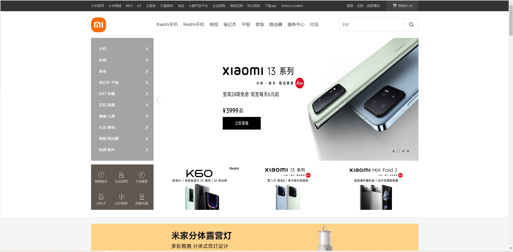

## 友情提示

> **快速体验项目**：[在线访问地址](http://store.toponlineweb.top/) 。

> **项目交流**：想要交流项目的朋友，可以加QQ或QQ邮箱与我联系。
> - QQ：3533643117 
> - QQ邮箱:3533643117@qq.com


## 项目介绍

`online-store`项目使用纯CSS、JS和HTML实现的京东官网首页，旨在通过模仿京东官网的设计和布局，来展示HTML、CSS和JS的基础知识和技能。该项目的实现主要包括以下几个方面：HTML结构：项目中使用HTML来搭建页面结构，包括头部导航栏、轮播图、各种商品分类、品牌特卖、热门推荐、底部信息等。CSS样式：项目中使用CSS来设置页面的样式，包括字体、颜色、排版、背景、边框、阴影、动画效果等。JS交互：项目中使用JS来实现页面的交互效果。


## 项目难点

`online-store`项目的难点主要在于对页面布局和样式的还原，以及对JS的运用。


## 项目演示

前端项目`online-store`地址：https://github.com/Fu-Huan-Mei/online-store.git

项目在线演示地址： [http://store.toponlineweb.top](http://store.toponlineweb.top/)  

项目展示：



## 技术选型

| 技术                | 说明                   | 官网                                                         |
| -----------------  | --------------------- | ------------------------------------------------------------ |
| HTML               | 网页结构| [https://developer.mozilla.org/zh-CN/docs/Web/HTML](https://developer.mozilla.org/zh-CN/docs/Web/HTML)                     |
| CSS                | 网页表现 | [https://developer.mozilla.org/zh-CN/docs/Learn/CSS](https://developer.mozilla.org/zh-CN/docs/Learn/CSS)       |
| Javascript         | 网页行为| [https://developer.mozilla.org/zh-CN/docs/learn/JavaScript](https://developer.mozilla.org/zh-CN/docs/learn/JavaScript)           |                   |


## 项目布局

``` lua

CSS -- 样式
    ├── base.css -- 网站基本的样式设置，如页面布局、字体、颜色等
    └── index.css -- 网站首页的样式设置，如轮播图、商品分类、热门商品展示等
FontAwesome -- 图标库
    ├── css -- 控制FontAwesome图标库的CSS文件
    └── webfonts -- 展示FontAwesome图标的字体文件
CssStyle -- 其他常用的样式控制
    ├── normalize.css -- 解决不同浏览器之间的兼容性问题
    └── reset.css -- 重置浏览器默认样式
iconfonts -- 自定义图标字体
picture -- 网站所需的图片文件夹
index.html -- 网站的首页HTML文件，用于展示网站内容和样式

```


## 感谢

如果对你有帮助送我一颗珍贵的小星星✨✨。


## 注意

由于本项目是仿照京东官网制作的，因此在实际开发中，需要遵循版权和知识产权相关法律法规，不得抄袭他人作品。


